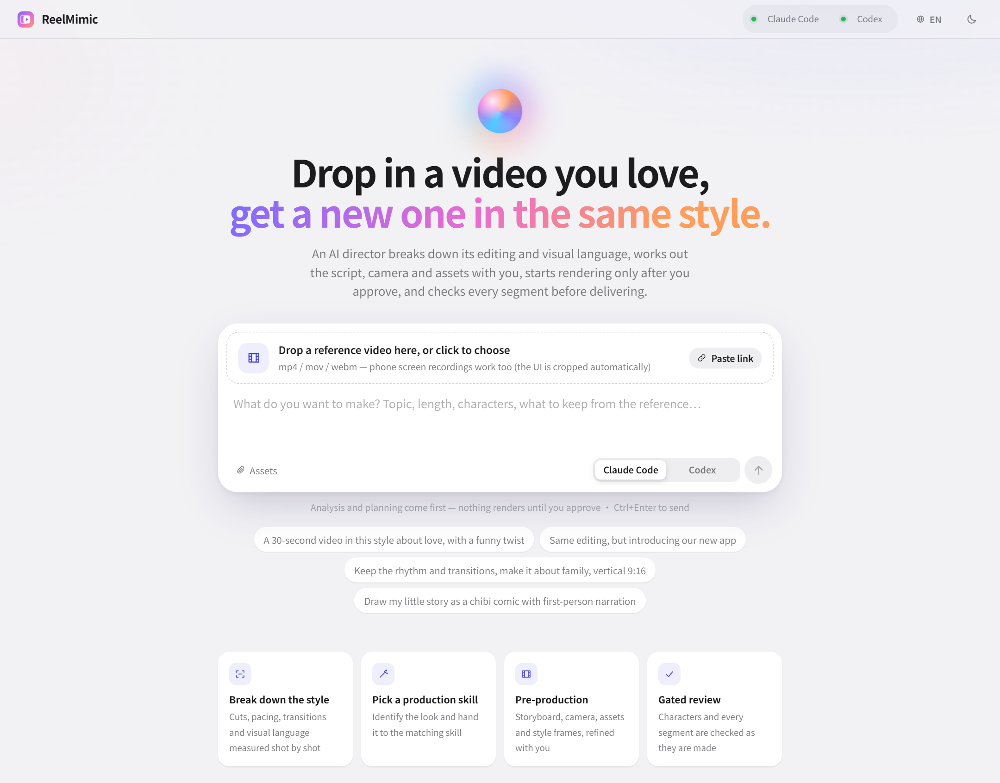
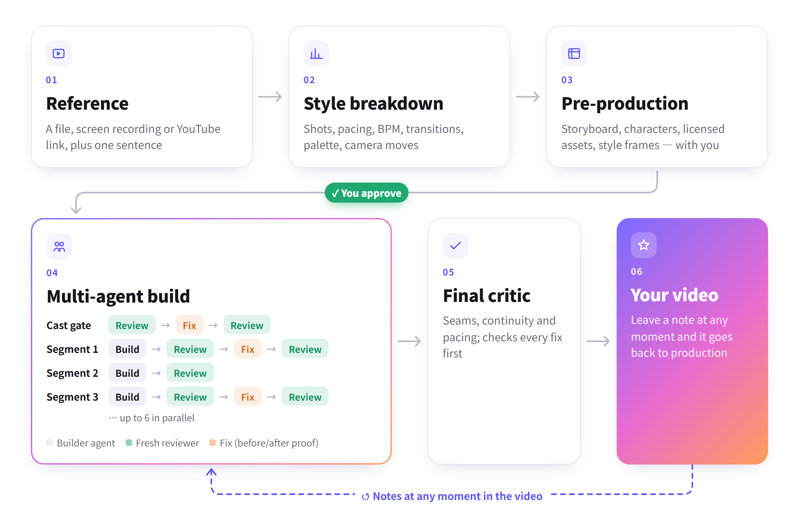

<div align="center">


# ReelMimic

**Drop in a video you love — an AI film crew makes you a new animation in the same style.**

[](LICENSE)
[](https://docs.anthropic.com/en/docs/claude-code)
[](https://github.com/openai/codex)


[繁體中文](README.md) · **English** · [简体中文](README.zh-CN.md)

<picture>
  <source media="(prefers-color-scheme: dark)" srcset="docs/assets/home-en-dark.png">
  
</picture>

</div>

## What it is

Give ReelMimic a reference video (a file, a phone screen recording or a YouTube link) and one sentence about what you
want. It breaks down the reference's editing, pacing, camera work and visual language, settles the plan with you,
and **only after you approve** does a team of AI agents build it, reviewing every shot, and deliver a brand-new 2D
animation in the same style.

It learns technique from the reference — never its footage, characters or assets. Everything runs on your own machine
with your own Claude Code or Codex account.

<p align="center">
<picture>
  <source media="(prefers-color-scheme: dark)" srcset="docs/assets/flow-en-dark.png">
  
</picture>
</p>

## Features

| Feature | What it does |
|---|---|
| **Style breakdown** | Measures shot count, average shot length, BPM, transitions, palette and camera moves; writes a shot-by-shot style report |
| **Plan before rendering** | Storyboard mapped shot-by-shot to the reference, licensed assets, style frames — iterate until you're happy |
| **Multi-agent production line** | Up to 6 builders in parallel; each finished shot is checked by a fresh reviewer on full-resolution frames, so defects are fixed where they're made |
| **Fixes come with proof** | Issues are graded *blocker* / *polish*; every fix carries before/after crops of the same moment |
| **See what the AI is doing** | Live thinking and steps for every agent, the frames it looked at, a full log; image attachments in chat |
| **Edit on the video itself** | Once the film is ready, type notes at any moment and send them all at once |
| **Extensible** | One Markdown file per style; production engines are ordinary agent skills — no code to add a style |
| **Three UI languages** | 繁體中文, English, 简体中文, switchable top right; the AI director replies in your language |

Currently 2D animation: flat-vector chibi, hand-painted watercolor, motion graphics and more. A 30-second video takes
about 1–2 hours from plan approval to final cut, depending on the look.

## Quick start

**You need**: Node.js 20+, Python 3.10+, FFmpeg, Chrome, and [Claude Code](https://docs.anthropic.com/en/docs/claude-code)
or [Codex CLI](https://github.com/openai/codex) (at least one, logged in).

```bash
git clone https://github.com/edenfunf/reelmimic.git && cd reelmimic
./install.sh      # Windows: double-click install.bat
./start.sh        # Windows: double-click start.bat
```

Open <http://localhost:4318>. The installer sets up the Python and web packages, builds the UI and checks your
environment (run `cd app && npm run doctor` any time). Claude Code loads the repo's `.claude/skills/` automatically and
Codex reads `AGENTS.md` — nothing else to configure.

### Your first video

1. On the home page, drop a reference video or paste a link, say what you want, and pick Claude Code or Codex.
2. Wait for the breakdown and the plan; comment in the chat on the right (screenshots welcome).
3. Provide or skip any inputs the plan asks for (e.g. lyrics), then click **Approve and start**.
4. Follow every character and segment, with review frames, in the **Production line** tab.
5. When the film is ready, leave notes right under the video at any moment.

## Configuration

API keys and local paths go in `~/.reelmimic/secrets.json` (outside the repo, never committed); see
[`secrets.example.json`](secrets.example.json).

| Key | Purpose |
|---|---|
| `YATING_KEY` | Yating Taiwan-Mandarin voices for narration |
| `PIXABAY_KEY`, `FREESOUND_KEY` | more license-safe images, music and sound effects (Openverse works without a key) |
| `FFMPEG_DIR`, `CHROME_PATH`, `CODEX_BIN`, `PYTHON` | tool locations when they're not on PATH |
| `BUILDERS`, `MAX_AGENTS` | parallel builders per video (default 6), agents at once across all projects (default 12) |
| `PORT` | web port (default 4318) |

## Docs

- [Architecture](docs/en/ARCHITECTURE.md): stages, production line, file contract, agent adapters
- [Extending](docs/en/EXTENDING.md): add styles, production engines and AI directors; change the pipeline
- [Contributing](CONTRIBUTING.md)

## Content principles

- Learn technique from the reference (rhythm, composition, transitions, how gags are built) — never copy its footage,
  characters, logos or assets.
- Characters are original by default; if you provide your own character designs, those are followed.
- External assets are logged with source, author and license (`assets/ASSETS.md`); unknown licenses are flagged.
- Lyrics come only from text you provide; commercial songs are never downloaded automatically.
- You are responsible for how you use the videos you generate.

## License

The code is released under the [MIT License](LICENSE). Bundled third-party skills and assets keep their own licenses —
see [THIRD_PARTY_NOTICES.md](THIRD_PARTY_NOTICES.md).
