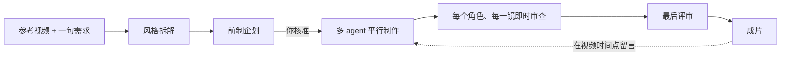

<div align="center">


# ReelMimic

**丢一支喜欢的视频，AI 导演团队帮你做出同样风格的新动画。**

[](LICENSE)
[](https://docs.anthropic.com/en/docs/claude-code)
[](https://github.com/openai/codex)


[繁體中文](README.md) · [English](README.en.md) · **简体中文**

<picture>
  <source media="(prefers-color-scheme: dark)" srcset="docs/assets/home-zh-CN-dark.png">
  
</picture>

</div>

## 这是什么

给它一支参考视频（文件、手机屏幕录像或 YouTube 链接）和一句需求，ReelMimic 会拆解那支片的剪法、节奏、运镜与画面语言，
和你一起把企划定下来，**你核准之后**才开始制作，并由一组 AI agent 分工完成、逐镜审查，最后交出同风格的全新 2D 动画。

参考片只学手法，不拷贝它的画面、角色或素材。全部在你自己的电脑上跑，用你自己的 Claude Code 或 Codex 账号。



## 特色

| 功能 | 说明 |
|---|---|
| **风格拆解** | 自动量测镜头数、平均镜长、BPM、转场、配色与运镜，产出逐镜风格报告 |
| **先企划再生成** | 分镜逐镜对照参考片、素材附授权、定调画面；来回讨论到你满意才开始 |
| **多 agent 生产线** | 最多 6 个制作 agent 平行，每做完一镜就由全新的审查员看全分辨率画面，缺陷在哪产生就在哪修 |
| **修正要有证据** | 问题分「必修／顺手修」两级，每个修正都附同一秒、同一位置的前后对照 |
| **看得见 AI 在做什么** | 即时显示每个 agent 的思考与步骤、看过的影格、完整纪录；对话可附图片 |
| **直接在视频上改** | 成片出来后，在任一时间点打修改意见，一次送出 |
| **可扩充** | 一种风格一个 Markdown 文件；制作引擎就是一般的 agent skill，加新风格不用写程序 |
| **三种界面语言** | 繁體中文、English、简体中文，右上角切换；AI 导演用你选的语言回报 |

目前支持 2D 动画：矢量 Q 版、手绘水彩、动态图像等。30 秒短片从核准企划到成片约 1–2 小时，依画风而定。

## 快速开始

**需要**：Node.js 20+、Python 3.10+、FFmpeg、Chrome，以及 [Claude Code](https://docs.anthropic.com/en/docs/claude-code) 或 [Codex CLI](https://github.com/openai/codex)（至少一个，已登录）。

```bash
git clone https://github.com/edenfunf/reelmimic.git && cd reelmimic
./install.sh      # Windows：双击 install.bat
./start.sh        # Windows：双击 start.bat
```

打开 <http://localhost:4318>。安装脚本会装好 Python 与网站套件、编译前端，并检查环境（之后可随时 `cd app && npm run doctor`）。
repo 里的 `.claude/skills/` 会被 Claude Code 自动加载，Codex 则读 `AGENTS.md`，不需要其他设置。

### 做第一支视频

1. 首页拖入参考视频或贴链接，写下想做什么，选 Claude Code 或 Codex。
2. 等 AI 拆解并写好企划，在右侧对话框提意见（可以附截屏）。
3. 提供或略过企划列出的素材（例如歌词），按「核准并开始生成」。
4. 在「生产线」分页看每个角色、每一段的进度与审查截屏。
5. 成片出来后，直接在视频下方针对某一秒留言修改。

## 设置

API 密钥与本机路径放在 `~/.reelmimic/secrets.json`（在 repo 外，不会被 commit），范本见 [`secrets.example.json`](secrets.example.json)。

| 键 | 用途 |
|---|---|
| `YATING_KEY` | 雅婷台湾华语语音（旁白） |
| `PIXABAY_KEY`、`FREESOUND_KEY` | 更多授权安全的图片、音乐、音效（没有也能用 Openverse） |
| `FFMPEG_DIR`、`CHROME_PATH`、`CODEX_BIN`、`PYTHON` | 工具不在 PATH 上时指定位置 |
| `BUILDERS`、`MAX_AGENTS` | 每支片平行的制作 agent 数（默认 6）、全部项目同时的 agent 上限（默认 12） |
| `PORT` | 网站端口号（默认 4318） |

## 文档

- [架构](docs/zh-CN/ARCHITECTURE.md)：流程、生产线、文件合约、agent 转接层
- [扩充指南](docs/zh-CN/EXTENDING.md)：添加风格、制作引擎、AI 导演，调整流程
- [贡献方式](CONTRIBUTING.md)

## 内容原则

- 参考片只学手法（节奏、构图、转场、笑点设计），不拷贝画面、角色、Logo 或素材。
- 角色默认原创；你提供自家角色的设计图时照着做。
- 外部素材记录来源、作者与授权（`assets/ASSETS.md`），授权不明的会标示。
- 歌词只用你提供的文本，不自动下载商业歌曲。
- 生成的视频如何使用由你负责确认。

## 授权

代码以 [MIT License](LICENSE) 发布。内含的第三方 skill 与素材保有各自的授权，见 [THIRD_PARTY_NOTICES.md](THIRD_PARTY_NOTICES.md)。
